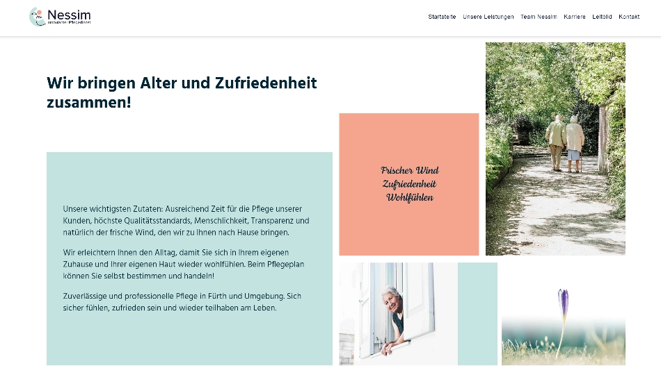
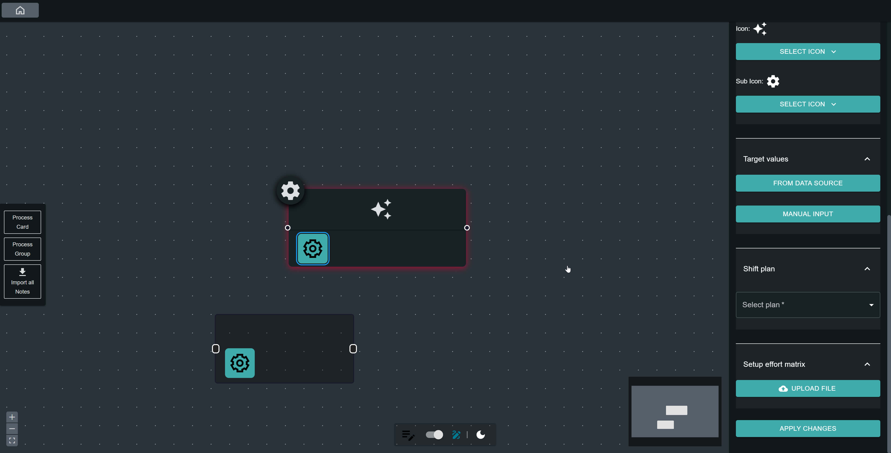
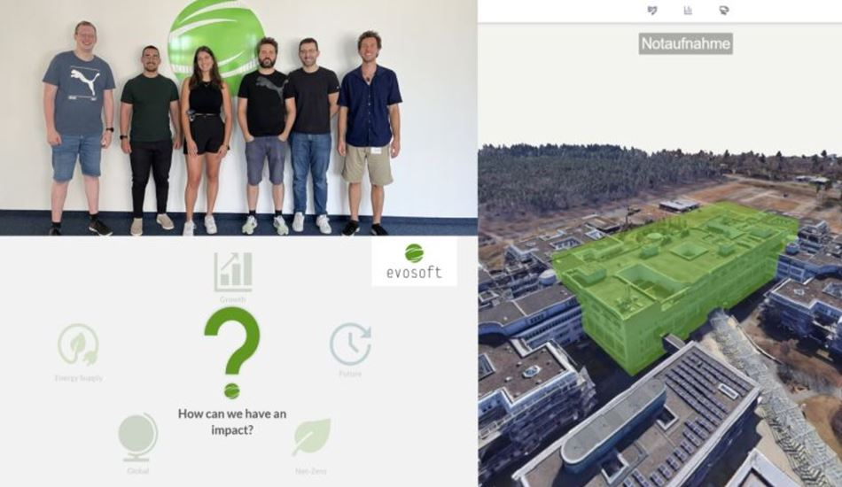

# Hey, I'm Berkay Yurdagül! Nice to Meet You! 

###

###

## About Me

I am a full-stack developer specializing in front-end development, currently living in Nuremberg. With enthusiasm and dedication, I program scalable, responsive, and high-performance websites/web-applications, always keeping accessibility in mind.  <a href="https://www.xn--berkayyurdagl-7ob.com/" target="_blank" rel="noopener noreferrer">See more</a>

###

## Fullstack Developer Skills

### Frontend Development

### Backend Development

### Database Management

### DevOps and Tools

### Testing

### Data Visualization

###

## Achievements

  

    
    
I assisted in the establishment of a home care service, which is a family-owned business. In my role as CIO, I oversee and manage the IT infrastructure to ensure seamless operations. I utilize Microsoft Entra for secure identity and access management, implementing best practices to maintain system efficiency and security. My responsibilities include providing technical support, improving our technological capabilities, and ensuring that our IT systems meet the growing needs of our business and clients.

  

  

  

    
    
evoSTRIVE is a web editor for value stream mapping, developed in collaboration with evosoft GmbH. The final product is already actively used by clients. For the project, I conducted numerous customer surveys, considered the interests of various stakeholders, and realized the software within a tight timeframe of just 2.5 months.

  

  

  

    
    
As the innovation team of evosoft GmbH, my five-member team and I participated in the Siemens AG Hackathon (Solve4Sustainability) and won first place in the Productivity category among 130 ideas. The project aimed to modernize and optimize the inventory management of medical supplies in hospitals.

  

